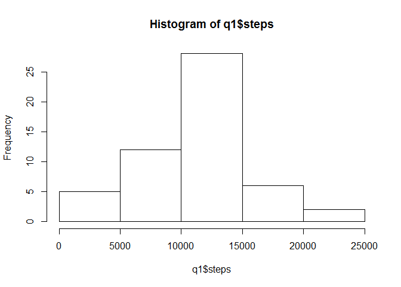
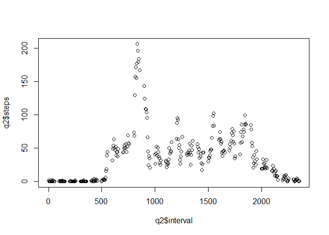
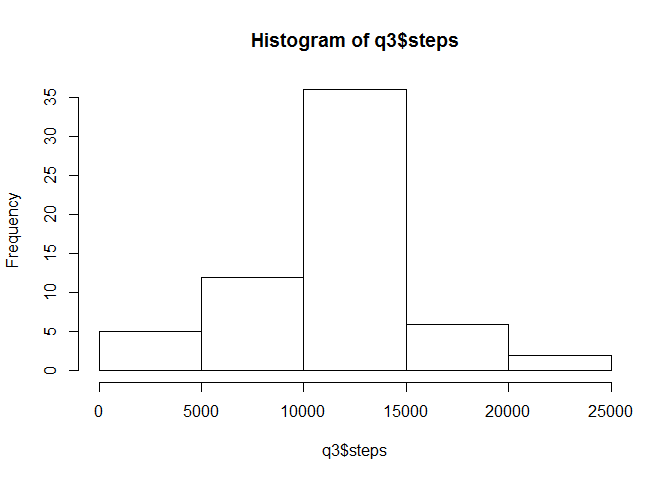
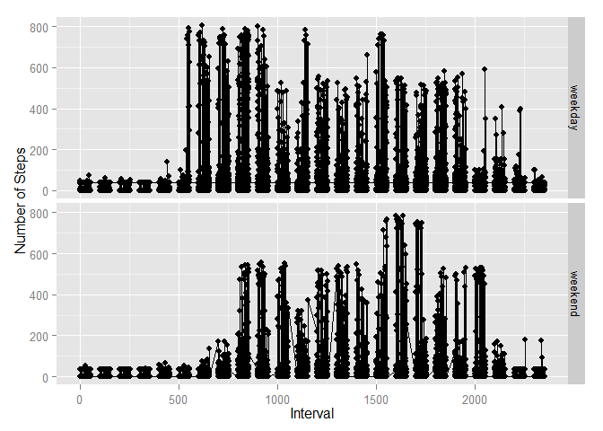

# PA1_template.Rmd

###Loading and preprocessing the data


```r
fileUrl= "http://d396qusza40orc.cloudfront.net/repdata%2Fdata%2Factivity.zip"
download.file(fileUrl, "activity.zip",mode="wb")
unzip("./activity.zip")


data <- read.csv("activity.csv",header=TRUE)
summary(data)
```

```
##      steps                date          interval     
##  Min.   :  0.00   2012-10-01:  288   Min.   :   0.0  
##  1st Qu.:  0.00   2012-10-02:  288   1st Qu.: 588.8  
##  Median :  0.00   2012-10-03:  288   Median :1177.5  
##  Mean   : 37.38   2012-10-04:  288   Mean   :1177.5  
##  3rd Qu.: 12.00   2012-10-05:  288   3rd Qu.:1766.2  
##  Max.   :806.00   2012-10-06:  288   Max.   :2355.0  
##  NA's   :2304     (Other)   :15840
```

###What is mean total number of steps taken per day?

Make a histogram of the total number of steps taken each day

```r
q1 <- aggregate(steps ~ date,data = data,FUN = sum)
hist(q1$steps)
```

 

Calculate and report the mean and median total number of steps taken per day

```r
mean(q1$steps)
```

```
## [1] 10766.19
```

```r
median(q1$steps)
```

```
## [1] 10765
```

###What is the average daily activity pattern?

Make a time series plot (i.e. type = "l") of the 5-minute interval (x-axis) and the average number of steps taken, averaged across all days (y-axis)

```r
q2 <- aggregate(steps ~ interval,data = data,FUN = mean,na.rm=TRUE)
plot(x=q2$interval, y=q2$steps)
```

 


Which 5-minute interval, on average across all the days in the dataset, contains the maximum number of steps?


```r
q2[which.max(q2$steps),1]
```

```
## [1] 835
```

###Imputing missing values

Calculate and report the total number of missing values in the dataset (i.e. the total number of rows with NAs)


```r
sum(is.na(data$steps))
```

```
## [1] 2304
```

Devise a strategy for filling in all of the missing values in the dataset. The strategy does not need to be sophisticated. For example, you could use the mean/median for that day, or the mean for that 5-minute interval, etc.

all missing values in the data set will be fill with the mean total number of steps per 5 minute interval


```r
filler <- mean(data$steps,na.rm=TRUE)
```

Create a new dataset that is equal to the original dataset but with the missing data filled in


```r
newdata <- data
newdata[is.na(newdata$steps),1] <- filler
```

Make a histogram of the total number of steps taken each day and Calculate and report the mean and median total number of steps taken per day. Do these values differ from the estimates from the first part of the assignment? What is the impact of imputing missing data on the estimates of the total daily number of steps?


```r
q3 <- aggregate(steps ~ date,data = newdata,FUN = sum)
hist(q3$steps)
```

 

```r
mean(q3$steps)
```

```
## [1] 10766.19
```

```r
median(q3$steps)
```

```
## [1] 10766.19
```

Values differ from the the first part of assignment by 1, the impact is insignificant differences using mean total number of steps per 5 minute interval

###Are there differences in activity patterns between weekdays and weekends?

Create a new factor variable in the dataset with two levels - "weekday" and "weekend" indicating whether a given date is a weekday or weekend day.


```r
newdata$day <- weekdays(as.POSIXct(as.character(newdata$date),format="%Y-%m-%d"))
newdata[!(newdata$day %in% c('Saturday','Sunday')),4] <- "weekday"
newdata[newdata$day %in% c('Saturday','Sunday'),4] <- "weekend"
newdata$day <- factor(newdata$day,labels=c("weekday","weekend"))
```

Make a panel plot containing a time series plot (i.e. type = "l") of the 5-minute interval (x-axis) and the average number of steps taken, averaged across all weekday days or weekend days (y-axis). See the README file in the GitHub repository to see an example of what this plot should look like using simulated data.


```r
require(ggplot2)
```

```
## Loading required package: ggplot2
```

```
## Warning: package 'ggplot2' was built under R version 3.1.2
```

```r
ggplot(data=newdata,aes(x=interval,y=steps)) + geom_line() + geom_point()+ ylab("Number of Steps") +xlab("Interval")+ facet_grid(day ~ .)
```

 
